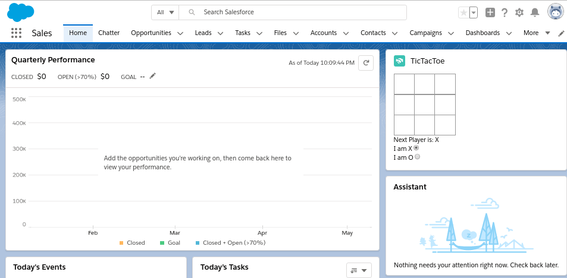

# TicTacToe with Salesforce Local Development Server

Implementation of TicTacToe game using the Salesforce Lightning Web Components (LWC)

A blog discussion available at [https://www.kleencut.net/blog/sf-lwc-ttt-ldev](https://www.kleencut.net/blog/sf-lwc-ttt-ldev)




## Run the example Project

Git clone the source

Create a scratch org from within the project directory.

This assume you have a default DevHub configured:

```bash
sfdx force:org:create -f ./config/project-scratch-def.json -a <name>

```

If a default DevHub is not configured then you need to add the --targetdevhubusername (-v) parameter:

```bash
sfdx force:org:create -f ./config/project-scratch-def.json -a <name> -v <Your-DevHub-Username>
```

As a side note, you can config a default DevHub globally (not project specific) by using the config command. For example:

```bash
sfdx force:config:set defaultdevhubusername=<username> -g
```

Once you have the scratch Org created you can set it as the default scratch org for the project. This will then be used for all future `push` and `pull` commands without needing the -u parameter.

```bash
sfdx force:config:set defaultusername=<username>
```

Push the project source to your scratch org (this command assumes that a scratch org has been set as the default see above)

```
sfdx force:source:push
```

Open the scratch org:

```bash
sfdx force:org:open -u <username>|<alias>
```

Tictactoe component is available in the App Builder


